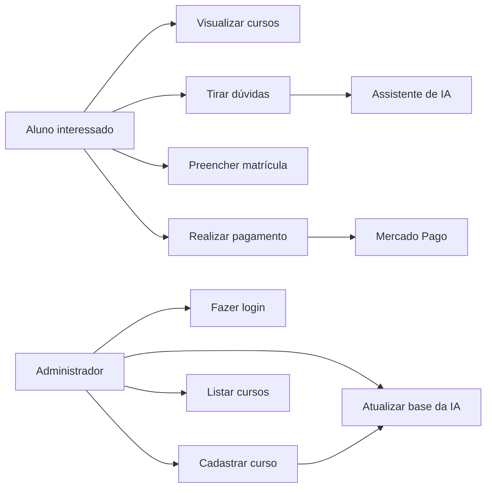
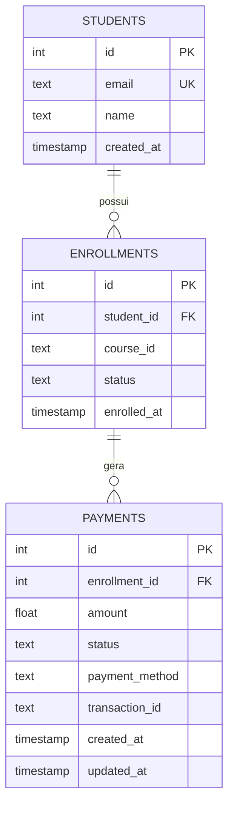
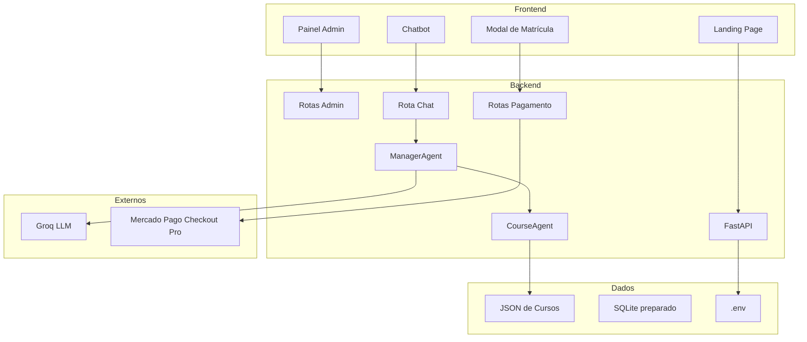

# Apresentação TCC - Global Training Technology

## Objetivo deste arquivo

Este documento resume o projeto em **10 slides** para apresentação à banca e contém um prompt pronto para gerar a apresentação no Gamma.

Tema do trabalho:

**Global Training Technology: plataforma de cursos com atendimento inteligente, gestão administrativa e integração de pagamentos.**

---

## Slide 1 - Capa

**Título:** Global Training Technology  
**Subtítulo:** Plataforma de cursos com IA, administração dinâmica e pagamento online

**Inserir:**

- Nome dos integrantes
- Orientador(a)
- Instituição
- Curso/disciplina
- Data

**Mensagem principal:** apresentar o projeto como uma solução para digitalizar e automatizar a jornada de matrícula em uma escola de cursos profissionalizantes.

---

## Slide 2 - Problema, motivação e mercado

### Problema

Escolas de cursos livres dependem de atendimento manual para responder dúvidas repetitivas sobre cursos, preço, modalidade, certificado e formas de pagamento. Isso gera demora no atendimento e pode reduzir conversões.

### Motivação

O mercado educacional está cada vez mais digital, e alunos esperam respostas rápidas antes de tomar decisão de compra. Pequenas escolas também precisam atualizar catálogo sem depender de alterações manuais no código.

### Oportunidade

Automatizar atendimento e matrícula com:

- IA para dúvidas comerciais;
- catálogo de cursos gerenciável;
- checkout seguro;
- backend modular e expansível.

---

## Slide 3 - Objetivo da proposta

### Objetivo geral

Desenvolver uma plataforma web para cursos profissionalizantes que centralize catálogo, atendimento com IA, cadastro administrativo e início de matrícula com pagamento online seguro.

### Objetivos específicos

- Criar uma landing page para apresentação dos cursos.
- Implementar chatbot integrado ao backend.
- Permitir cadastro dinâmico de cursos por painel administrativo.
- Fazer os cursos cadastrados alimentarem a landing e a IA.
- Integrar pagamento por Mercado Pago Checkout Pro.
- Proteger dados sensíveis e rotas administrativas.

---

## Slide 4 - Solução desenvolvida e funcionalidades

### Módulos da solução

1. **Landing page pública**
   - Apresenta a Global Training Technology.
   - Lista cursos vindos do backend.
   - Abre chat e matrícula.

2. **Chatbot com IA**
   - Recebe perguntas do usuário.
   - Identifica intenção e curso.
   - Responde com base nos dados cadastrados.

3. **Painel administrativo**
   - Login administrativo.
   - Cadastro de cursos.
   - Listagem de cursos cadastrados.
   - Recarregamento da base da IA.

4. **Pagamento online**
   - Modal de matrícula.
   - Criação de checkout no Mercado Pago.
   - Checkout aberto em nova aba.
   - Webhook preparado para status de pagamento.

---

## Slide 5 - Caso de uso geral



### Atores

- **Aluno:** acessa a landing, conversa com a IA e inicia matrícula.
- **Administrador:** acessa o painel protegido e cadastra cursos.
- **IA:** auxilia no atendimento.
- **Mercado Pago:** processa o pagamento fora do sistema.

---

## Slide 6 - Modelo físico de banco e dados

O projeto possui uma estrutura SQLite preparada para a evolução do sistema.



### Estado atual

- Cursos são armazenados em JSON para facilitar cadastro e leitura pela IA.
- SQLite já possui estrutura para alunos, matrículas e pagamentos.
- Próxima etapa: persistir matrículas reais e status de pagamento aprovado.

---

## Slide 7 - Modelo arquitetural e tecnologias



### Tecnologias

- **Frontend:** HTML5, CSS3, JavaScript.
- **Backend:** Python, FastAPI, Uvicorn, Pydantic, Requests.
- **IA:** Groq API, ManagerAgent, CourseAgent.
- **Dados:** JSON e SQLite.
- **Pagamento:** Mercado Pago Checkout Pro.
- **Segurança:** `.env`, `.gitignore`, login admin e token temporário.

---

## Slide 8 - Metodologia utilizada

Abordagem inspirada em Scrum, com entregas incrementais.

| Sprint | Objetivo | Entregas |
|---|---|---|
| 1 | Requisitos e arquitetura | Definição do problema, tecnologias e estrutura inicial. |
| 2 | Backend e cursos | FastAPI, rotas, JSONs de cursos e agents. |
| 3 | Frontend | Landing, cards de cursos, chat e modal. |
| 4 | Admin e IA | Painel administrativo, cadastro de curso, recarregamento da IA. |
| 5 | Segurança e pagamento | Login admin, Mercado Pago, `.env`, documentação e apresentação. |

### Sprint em destaque

**Sprint 4 - Admin e IA**

- Criação de formulário administrativo.
- Envio para `POST /api/admin/create-course`.
- Salvamento do curso em JSON.
- Recarregamento do `ManagerAgent`.
- Curso passa a aparecer na landing e nas respostas da IA.

---

## Slide 9 - Segurança, demonstração e resultados

### Segurança

- `.env` não é versionado.
- `ADMIN_PASSWORD` e `ADMIN_TOKEN_SECRET` ficam no backend.
- Painel administrativo exige login.
- Rotas admin usam `Authorization: Bearer`.
- Token administrativo tem expiração.
- Token Mercado Pago fica apenas no backend.
- Dados de cartão não passam pela aplicação.
- Checkout ocorre no Mercado Pago.

### Demonstração sugerida

1. Abrir landing.
2. Mostrar cursos carregados.
3. Conversar com IA.
4. Abrir admin e fazer login.
5. Cadastrar curso.
6. Voltar para landing.
7. Iniciar matrícula.
8. Abrir checkout Mercado Pago.

### Resultados alcançados

- MVP funcional.
- Chatbot integrado.
- Cursos dinâmicos.
- Admin protegido.
- Checkout Mercado Pago.
- Arquitetura preparada para evolução.

---

## Slide 10 - Next Steps e encerramento

### Próximos passos para a próxima etapa do trabalho

1. **Persistir matrículas e pagamentos no SQLite**
   - Salvar aluno, matrícula, preferência de pagamento e status.

2. **Concluir fluxo de webhook**
   - Liberar matrícula apenas quando `payment_status == approved`.

3. **Criar área do aluno**
   - Login do aluno, acesso ao curso e status da matrícula.

4. **Melhorar gestão administrativa**
   - Editar/deletar cursos pela interface.
   - Dashboard de matrículas.

5. **Deploy**
   - Publicar backend em servidor.
   - Configurar URL pública para webhook Mercado Pago.
   - Configurar domínio da landing.

6. **Recursos futuros**
   - Certificados.
   - Relatórios.
   - Analytics de dúvidas frequentes.
   - Gestão de turmas.

### Fechamento

A solução demonstra como IA, automação administrativa e checkout seguro podem melhorar a jornada de matrícula em escolas de cursos profissionalizantes.

---

# Prompt para Gamma - 10 slides

Copie e cole no Gamma:

```text
Crie uma apresentação acadêmica profissional para uma banca de TCC, em português do Brasil, com exatamente 10 slides.

Tema:
"Global Training Technology: Plataforma de cursos com atendimento inteligente, gestão administrativa e integração de pagamentos".

Contexto:
O projeto é um MVP web para uma escola de cursos profissionalizantes. A plataforma possui landing page pública, chatbot com IA, painel administrativo protegido por login, cadastro dinâmico de cursos, cursos armazenados em JSON, backend em FastAPI, agentes de IA usando Groq, estrutura SQLite preparada para matrículas/pagamentos e integração com Mercado Pago Checkout Pro.

Estilo visual:
- moderno, limpo e tecnológico;
- paleta grafite escuro, branco, azul/ciano e detalhes laranja;
- ícones simples;
- pouco texto por slide;
- usar diagramas visuais;
- adequado para apresentação de TCC em até 20 minutos.

Slides:

1. Capa
Título: Global Training Technology
Subtítulo: Plataforma de cursos com IA, administração dinâmica e pagamento online
Campos: integrantes, orientador, instituição, data.

2. Problema, motivação e mercado
Explicar a dificuldade de atendimento manual em escolas de cursos livres, dúvidas repetitivas dos alunos, atualização manual de catálogo e perda de conversão. Mostrar oportunidade com IA, automação e checkout online.

3. Objetivo da proposta
Objetivo geral: desenvolver uma plataforma web para cursos profissionalizantes que centralize catálogo, atendimento com IA, cadastro administrativo e início de matrícula com pagamento online seguro.
Objetivos específicos: landing, chatbot, admin, cursos dinâmicos, checkout seguro e proteção de dados.

4. Solução desenvolvida e funcionalidades
Mostrar quatro blocos:
Landing page pública, Chatbot com IA, Painel administrativo, Pagamento online.
Explicar que os cursos cadastrados alimentam tanto a landing quanto a IA.

5. Caso de uso geral
Criar diagrama com atores:
Aluno, Administrador, Assistente de IA e Mercado Pago.
Casos:
Visualizar cursos, tirar dúvidas, preencher matrícula, realizar pagamento, fazer login admin, cadastrar curso, listar cursos e atualizar base da IA.

6. Modelo físico de banco e dados
Mostrar ER com:
students(id, email, name, created_at)
enrollments(id, student_id, course_id, status, enrolled_at)
payments(id, enrollment_id, amount, status, payment_method, transaction_id, created_at, updated_at)
Explicar que SQLite está preparado e cursos estão em JSON no MVP.

7. Modelo arquitetural e tecnologias
Diagrama em camadas:
Frontend: Landing, Admin, Chatbot, Modal.
Backend: FastAPI, Admin Routes, Chat Route, Payments Routes, ManagerAgent, CourseAgent.
Dados: JSON, SQLite, .env.
Externos: Groq e Mercado Pago.
Listar tecnologias por categoria.

8. Metodologia utilizada
Mostrar 5 Sprints:
1 Requisitos e arquitetura
2 Backend e cursos
3 Frontend
4 Admin e IA
5 Segurança e pagamento
Destacar Sprint 4: curso criado no admin vira JSON, recarrega ManagerAgent e aparece na landing/chatbot.

9. Segurança, demonstração e resultados
Segurança: .env, login admin, token temporário, Bearer Token, checkout hospedado, cartão não passa pelo sistema.
Demonstração: landing → IA → login admin → cadastro curso → matrícula → checkout.
Resultados: MVP funcional, chatbot, cursos dinâmicos, admin protegido, Mercado Pago.

10. Next Steps e encerramento
Próximos passos:
persistir matrículas e pagamentos no SQLite;
finalizar webhook;
criar área do aluno;
editar/deletar cursos pelo admin;
dashboard;
deploy;
certificados;
analytics.
Fechar com: "A solução demonstra como IA, automação administrativa e checkout seguro podem melhorar a jornada de matrícula em escolas de cursos profissionalizantes."

Inclua notas curtas de fala para cada slide.
```

