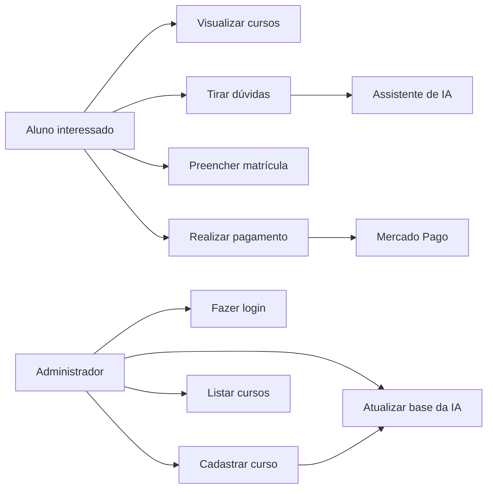
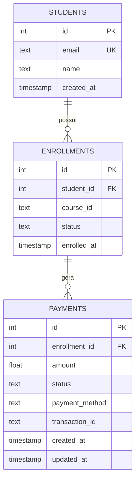
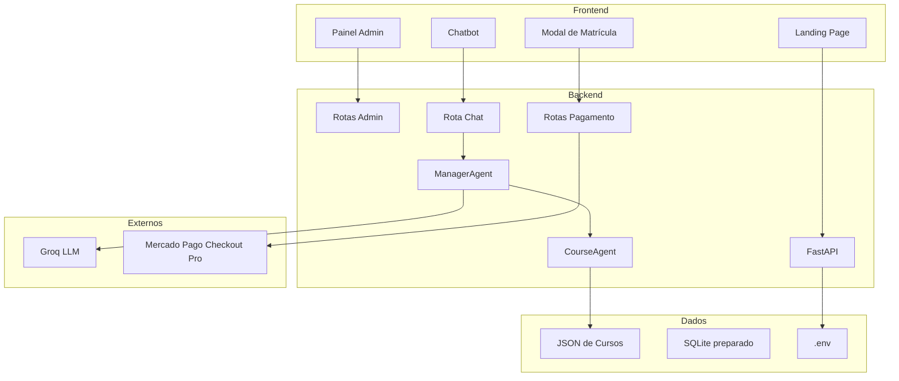

# Apresentação TCC - Global Training Technology

## Objetivo deste arquivo

Este documento resume o projeto em **10 slides** para apresentação à banca e contém um prompt pronto para gerar a apresentação no Gamma.

Tema do trabalho:

**Global Training Technology: plataforma de cursos com atendimento inteligente, gestão administrativa e integração de pagamentos.**

---

## Slide 1 - Capa

**Título:** Global Training Technology  
**Subtítulo:** Plataforma de cursos com IA, administração dinâmica e pagamento online

**Inserir:**

- Nome dos integrantes
- Orientador(a)
- Instituição
- Curso/disciplina
- Data

**Mensagem principal:** apresentar o projeto como uma solução para digitalizar e automatizar a jornada de matrícula em uma escola de cursos profissionalizantes.

---

## Slide 2 - Problema, motivação e mercado

### Problema

Escolas de cursos livres dependem de atendimento manual para responder dúvidas repetitivas sobre cursos, preço, modalidade, certificado e formas de pagamento. Isso gera demora no atendimento e pode reduzir conversões.

### Motivação

O mercado educacional está cada vez mais digital, e alunos esperam respostas rápidas antes de tomar decisão de compra. Pequenas escolas também precisam atualizar catálogo sem depender de alterações manuais no código.

### Oportunidade

Automatizar atendimento e matrícula com:

- IA para dúvidas comerciais;
- catálogo de cursos gerenciável;
- checkout seguro;
- backend modular e expansível.

---

## Slide 3 - Objetivo da proposta

### Objetivo geral

Desenvolver uma plataforma web para cursos profissionalizantes que centralize catálogo, atendimento com IA, cadastro administrativo e início de matrícula com pagamento online seguro.

### Objetivos específicos

- Criar uma landing page para apresentação dos cursos.
- Implementar chatbot integrado ao backend.
- Permitir cadastro dinâmico de cursos por painel administrativo.
- Fazer os cursos cadastrados alimentarem a landing e a IA.
- Integrar pagamento por Mercado Pago Checkout Pro.
- Proteger dados sensíveis e rotas administrativas.

---

## Slide 4 - Solução desenvolvida e funcionalidades

### Módulos da solução

1. **Landing page pública**
   - Apresenta a Global Training Technology.
   - Lista cursos vindos do backend.
   - Abre chat e matrícula.

2. **Chatbot com IA**
   - Recebe perguntas do usuário.
   - Identifica intenção e curso.
   - Responde com base nos dados cadastrados.

3. **Painel administrativo**
   - Login administrativo.
   - Cadastro de cursos.
   - Listagem de cursos cadastrados.
   - Recarregamento da base da IA.

4. **Pagamento online**
   - Modal de matrícula.
   - Criação de checkout no Mercado Pago.
   - Checkout aberto em nova aba.
   - Webhook preparado para status de pagamento.

---

## Slide 5 - Caso de uso geral



### Atores

- **Aluno:** acessa a landing, conversa com a IA e inicia matrícula.
- **Administrador:** acessa o painel protegido e cadastra cursos.
- **IA:** auxilia no atendimento.
- **Mercado Pago:** processa o pagamento fora do sistema.

---

## Slide 6 - Modelo físico de banco e dados

O projeto possui uma estrutura SQLite preparada para a evolução do sistema.



### Estado atual

- Cursos são armazenados em JSON para facilitar cadastro e leitura pela IA.
- SQLite já possui estrutura para alunos, matrículas e pagamentos.
- Próxima etapa: persistir matrículas reais e status de pagamento aprovado.

---

## Slide 7 - Modelo arquitetural e tecnologias



### Tecnologias

- **Frontend:** HTML5, CSS3, JavaScript.
- **Backend:** Python, FastAPI, Uvicorn, Pydantic, Requests.
- **IA:** Groq API, ManagerAgent, CourseAgent.
- **Dados:** JSON e SQLite.
- **Pagamento:** Mercado Pago Checkout Pro.
- **Segurança:** `.env`, `.gitignore`, login admin e token temporário.

---

## Slide 8 - Metodologia utilizada

Abordagem inspirada em Scrum, com entregas incrementais.

| Sprint | Objetivo | Entregas |
|---|---|---|
| 1 | Requisitos e arquitetura | Definição do problema, tecnologias e estrutura inicial. |
| 2 | Backend e cursos | FastAPI, rotas, JSONs de cursos e agents. |
| 3 | Frontend | Landing, cards de cursos, chat e modal. |
| 4 | Admin e IA | Painel administrativo, cadastro de curso, recarregamento da IA. |
| 5 | Segurança e pagamento | Login admin, Mercado Pago, `.env`, documentação e apresentação. |

### Sprint em destaque

**Sprint 4 - Admin e IA**

- Criação de formulário administrativo.
- Envio para `POST /api/admin/create-course`.
- Salvamento do curso em JSON.
- Recarregamento do `ManagerAgent`.
- Curso passa a aparecer na landing e nas respostas da IA.

---

## Slide 9 - Segurança, demonstração e resultados

### Segurança

- `.env` não é versionado.
- `ADMIN_PASSWORD` e `ADMIN_TOKEN_SECRET` ficam no backend.
- Painel administrativo exige login.
- Rotas admin usam `Authorization: Bearer`.
- Token administrativo tem expiração.
- Token Mercado Pago fica apenas no backend.
- Dados de cartão não passam pela aplicação.
- Checkout ocorre no Mercado Pago.

### Demonstração sugerida

1. Abrir landing.
2. Mostrar cursos carregados.
3. Conversar com IA.
4. Abrir admin e fazer login.
5. Cadastrar curso.
6. Voltar para landing.
7. Iniciar matrícula.
8. Abrir checkout Mercado Pago.

### Resultados alcançados

- Sistema funcional.
- Chatbot integrado.
- Cursos dinâmicos.
- Admin protegido.
- Checkout Mercado Pago.
- Arquitetura preparada para evolução.

---

## Slide 10 - Next Steps e encerramento

### Próximos passos para a próxima etapa do trabalho

1. **Persistir matrículas e pagamentos no SQLite**
   - Salvar aluno, matrícula, preferência de pagamento e status.

2. **Concluir fluxo de webhook**
   - Liberar matrícula apenas quando `payment_status == approved`.

3. **Criar área do aluno**
   - Login do aluno, acesso ao curso e status da matrícula.

4. **Melhorar gestão administrativa**
   - Editar/deletar cursos pela interface.
   - Dashboard de matrículas.

5. **Deploy**
   - Publicar backend em servidor.
   - Configurar URL pública para webhook Mercado Pago.
   - Configurar domínio da landing.

6. **Recursos futuros**
   - Certificados.
   - Relatórios.
   - Analytics de dúvidas frequentes.
   - Gestão de turmas.

### Fechamento

A solução demonstra como IA, automação administrativa e checkout seguro podem melhorar a jornada de matrícula em escolas de cursos profissionalizantes.

---

# Prompt para Gamma - 10 slides

Copie e cole no Gamma:

```text
Crie uma apresentação acadêmica profissional para uma banca de TCC, em português do Brasil, com exatamente 10 cartões/slides.

Tema geral:
"Global Training Technology: Plataforma de cursos com atendimento inteligente, gestão administrativa e integração de pagamentos".

Contexto geral do projeto:
O projeto é uma aplicação web para uma escola de cursos profissionalizantes. A plataforma possui landing page pública, chatbot com IA, painel administrativo protegido por login, cadastro dinâmico de cursos, cursos armazenados em JSON, backend em FastAPI, agentes de IA usando Groq, estrutura SQLite preparada para matrículas/pagamentos e integração com Mercado Pago Checkout Pro.

Direção visual:
- visual acadêmico, moderno, limpo e tecnológico;
- paleta grafite escuro, branco, azul/ciano e detalhes laranja;
- usar ícones simples para IA, cursos, admin, pagamento, segurança e banco de dados;
- pouco texto por cartão;
- priorizar diagramas visuais, fluxos e blocos;
- adequado para apresentação de TCC em até 20 minutos.

---

Cartão 1 - Capa

Título:
Global Training Technology

Subtítulo:
Plataforma de cursos com IA, administração dinâmica e pagamento online

Elementos no cartão:
- Integrantes: preencher nomes
- Orientador(a): preencher
- Instituição: preencher
- Curso/disciplina: preencher
- Data: preencher

Sugestão visual:
Usar fundo grafite escuro, logotipo/nome Global Training Technology em destaque, detalhe em azul/ciano e laranja, com composição limpa e acadêmica.

---

Cartão 2 - Problema, motivação e mercado

Título:
Problema e oportunidade

Pontos-chave:
- Escolas de cursos livres dependem de atendimento manual.
- Alunos fazem dúvidas repetitivas sobre preço, certificado, modalidade e conteúdo.
- Catálogo de cursos costuma exigir atualização manual.
- A demora no atendimento pode reduzir conversões.
- Há oportunidade de usar IA, automação e checkout online.

Sugestão visual:
Usar um fluxo simples com "Dúvida do aluno → Demora no atendimento → Perda de matrícula" e, ao lado, "IA + Admin + Pagamento → Jornada mais rápida".

---

Cartão 3 - Objetivo da proposta

Título:
Objetivo do projeto

Objetivo geral:
Desenvolver uma plataforma web para cursos profissionalizantes que centralize catálogo, atendimento com IA, cadastro administrativo e início de matrícula com pagamento online seguro.

Objetivos específicos:
- Criar uma landing page pública para apresentar cursos.
- Implementar chatbot integrado ao backend.
- Permitir cadastro dinâmico de cursos.
- Fazer os cursos cadastrados alimentarem a landing e a IA.
- Integrar checkout seguro por Mercado Pago.
- Proteger dados sensíveis e rotas administrativas.

Sugestão visual:
Usar seis cards pequenos com ícones: Landing, IA, Admin, Cursos, Pagamento, Segurança.

---

Cartão 4 - Solução desenvolvida e funcionalidades

Título:
Solução implementada

Quatro blocos principais:
- Landing page pública: apresenta a escola e lista cursos vindos do backend.
- Chatbot com IA: responde dúvidas do aluno com base nos dados cadastrados.
- Painel administrativo: permite cadastrar cursos após login.
- Pagamento online: cria checkout seguro no Mercado Pago.

Ponto de destaque:
O curso cadastrado no painel administrativo passa a alimentar tanto a landing quanto o chatbot.

Sugestão visual:
Diagrama em quatro blocos conectados:
Admin → Cursos JSON → Landing + Chatbot → Checkout.

---

Cartão 5 - Caso de uso geral

Título:
Caso de uso geral

Atores:
- Aluno
- Administrador
- Assistente de IA
- Mercado Pago

Casos de uso do aluno:
- Visualizar cursos
- Tirar dúvidas
- Preencher matrícula
- Realizar pagamento

Casos de uso do administrador:
- Fazer login
- Cadastrar curso
- Listar cursos
- Atualizar base da IA

Sugestão visual:
Criar um diagrama de caso de uso com os quatro atores e os casos conectados.

---

Cartão 6 - Modelo físico de banco e dados

Título:
Modelo físico e estrutura de dados

Modelo SQLite preparado:
- students(id, email, name, created_at)
- enrollments(id, student_id, course_id, status, enrolled_at)
- payments(id, enrollment_id, amount, status, payment_method, transaction_id, created_at, updated_at)

Relacionamentos:
- students 1:N enrollments
- enrollments 1:N payments

Estado atual:
- Na versão atual, cursos estão em JSON para facilitar cadastro e leitura pela IA.
- SQLite está preparado para persistir alunos, matrículas e pagamentos em uma próxima etapa.

Sugestão visual:
Mostrar um mini diagrama ER com as três tabelas e, ao lado, um card "Cursos em JSON".

---

Cartão 7 - Modelo arquitetural e tecnologias

Título:
Arquitetura da solução

Camadas:
- Frontend: Landing, Admin, Chatbot, Modal de matrícula.
- Backend: FastAPI, Admin Routes, Chat Route, Payments Routes.
- IA: ManagerAgent, CourseAgent, Groq API.
- Dados: JSON, SQLite preparado, .env.
- Serviços externos: Mercado Pago Checkout Pro.

Tecnologias:
- HTML5, CSS3, JavaScript
- Python, FastAPI, Uvicorn, Pydantic, Requests
- Groq API
- Mercado Pago Checkout Pro
- SQLite e JSON

Sugestão visual:
Criar diagrama em camadas com setas:
Frontend → FastAPI → Agents/Dados/Pagamento.

---

Cartão 8 - Metodologia utilizada

Título:
Metodologia e Sprints

Abordagem:
Desenvolvimento incremental inspirado em Scrum, com ciclos curtos de entrega, validação e ajuste.

Sprints:
- Sprint 1: Requisitos e arquitetura.
- Sprint 2: Backend e estrutura de cursos.
- Sprint 3: Frontend e landing page.
- Sprint 4: Painel administrativo e IA.
- Sprint 5: Segurança, pagamento e preparação da apresentação.

Sprint em destaque:
Sprint 4 - O curso criado no admin vira JSON, recarrega o ManagerAgent e aparece na landing/chatbot.

Sugestão visual:
Linha do tempo com 5 Sprints.

---

Cartão 9 - Segurança, demonstração e resultados

Título:
Segurança e resultados alcançados

Segurança:
- .env não versionado.
- Admin protegido por login.
- Token administrativo temporário.
- Rotas administrativas protegidas com Bearer Token.
- Token Mercado Pago apenas no backend.
- Cartão não passa pelo sistema.
- Checkout hospedado no Mercado Pago.

Demonstração:
Landing → IA → login admin → cadastro de curso → matrícula → checkout.

Resultados:
- Sistema funcional.
- Chatbot integrado.
- Cursos dinâmicos.
- Admin protegido.
- Checkout Mercado Pago.
- Arquitetura modular.

Sugestão visual:
Dividir em três colunas: Segurança, Demo, Resultados.

---

Cartão 10 - Next Steps e encerramento

Título:
Próximos passos

Next Steps:
- Persistir matrículas e pagamentos no SQLite.
- Finalizar webhook para liberar matrícula apenas com pagamento aprovado.
- Criar área do aluno.
- Implementar edição e exclusão de cursos pelo painel.
- Criar dashboard administrativo.
- Fazer deploy com URL pública para webhook.
- Adicionar certificados.
- Adicionar analytics de dúvidas e conversões.

Mensagem final:
"A solução demonstra como IA, automação administrativa e checkout seguro podem melhorar a jornada de matrícula em escolas de cursos profissionalizantes."

Sugestão visual:
Roadmap em três fases:
Versão atual → Validação com banco/webhook → Produto completo com área do aluno e dashboard.
```
